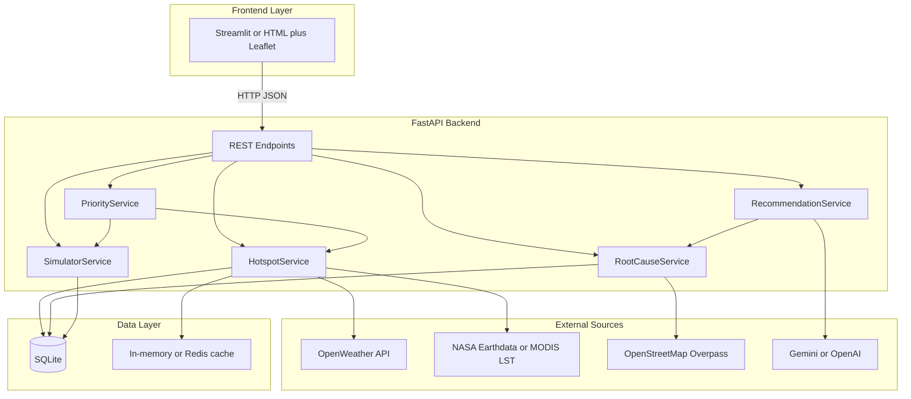

# Urban Heat Platform — Backend Implementation Plan

## Context: Frontend vs. Hackathon Plan

Your workspace currently contains a **single static HTML file** — [`ISROH2SKILL(Frontend).html`](C:\Users\VANSH\Downloads\frontend\ISROH2SKILL(Frontend).html) — for **CloudVision AI** (LISS-IV cloud removal). It has **no API calls**, **no urban heat UI**, and **no backend contracts**.

Your uploaded hackathon plan targets a **different product**: **AI-Powered Urban Heat Hotspot & Cooling Recommendation Platform** with features:

1. Heat hotspot detection (city heat map)
2. Root cause analysis (tree cover, concrete, traffic, water bodies)
3. AI cooling recommendations
4. What-if simulator
5. Priority ranking

**Recommendation:** Treat Urban Heat as a **new backend + frontend pair**. Keep the CloudVision HTML as a separate demo page, or reuse its visual style later. For the hackathon MVP, follow your plan images: **Python backend + map-centric UI** (Streamlit is fastest; your HTML can call the same API via `fetch()` if you prefer).

Default demo region (configurable): use **Bhopal** (~23.19°N, 78.46°E — already referenced in your HTML) or any Indian city via env config.

---

## Target Architecture



**Why FastAPI (not Streamlit-only logic):** Clean separation for judging demos, easy Swagger docs at `/docs`, and both Streamlit and your HTML can consume the same JSON. Streamlit can remain a thin UI shell that calls `http://localhost:8000`.

---

## Suggested Repo Layout

Create a sibling folder (e.g. `C:\Users\VANSH\Downloads\urban-heat-backend\`):

```
urban-heat-backend/
├── app/
│   ├── main.py                 # FastAPI app, CORS, lifespan
│   ├── config.py               # Settings from .env
│   ├── api/
│   │   └── routes/
│   │       ├── hotspots.py
│   │       ├── analysis.py
│   │       ├── recommendations.py
│   │       ├── simulator.py
│   │       └── priority.py
│   ├── services/
│   │   ├── hotspot_service.py
│   │   ├── root_cause_service.py
│   │   ├── recommendation_service.py
│   │   ├── simulator_service.py
│   │   └── priority_service.py
│   ├── models/
│   │   └── schemas.py          # Pydantic request/response models
│   ├── data/
│   │   ├── ingest.py           # Download/cache open datasets
│   │   └── sample/             # GeoJSON grids for offline demo
│   └── db/
│       ├── database.py
│       └── models.py           # SQLAlchemy tables
├── scripts/
│   └── seed_demo_data.py
├── requirements.txt
├── .env.example
└── README.md
```

---

## Phase 0 — Bootstrap (Day 1, ~2–3 hours)

**Goal:** Runnable API with health check and one working endpoint.

1. **Initialize Python project**
   - Python 3.11+, `fastapi`, `uvicorn`, `pydantic-settings`, `httpx`, `sqlalchemy`, `geojson`, `shapely`, `numpy`, `pandas`
   - Optional: `rasterio` / `xarray` if you ingest real MODIS/LST rasters later

2. **Environment variables** (`.env.example`)
   - `OPENWEATHER_API_KEY`
   - `GEMINI_API_KEY` or `OPENAI_API_KEY`
   - `DEMO_CITY=Bhopal`
   - `DEMO_BBOX=77.3,23.1,77.5,23.3` (min_lon,min_lat,max_lon,max_lat)
   - `DATABASE_URL=sqlite:///./urban_heat.db`

3. **Core config + CORS**
   - Allow `http://localhost:8501` (Streamlit) and `file://` or local HTML dev server origins

4. **Seed offline demo data** (critical for hackathon reliability)
   - Generate a **grid of cells** (e.g. 500m × 500m) over the city bbox
   - Each cell: `cell_id`, `centroid_lat/lon`, `temperature_c`, `tree_cover_pct`, `impervious_pct`, `traffic_index`, `water_proximity_m`
   - Store as GeoJSON in SQLite so demos work **without live NASA/API calls**

---

## Phase 1 — Feature 1: Heat Hotspot Detection

**Backend responsibility:** Return geospatial heat data for map rendering (Leaflet/Folium/Streamlit map).

### Endpoint

`GET /api/v1/hotspots?city=Bhopal&date=2026-06-24`

### Response shape (frontend contract)

```json
{
  "city": "Bhopal",
  "date": "2026-06-24",
  "bbox": [77.3, 23.1, 77.5, 23.3],
  "cells": [
    {
      "cell_id": "BHP_001",
      "geometry": { "type": "Polygon", "coordinates": [[...]] },
      "temperature_c": 38.2,
      "anomaly_c": 3.1,
      "severity": "high"
    }
  ],
  "stats": {
    "mean_temp_c": 34.5,
    "max_temp_c": 41.2,
    "hotspot_count": 12
  }
}
```

### Implementation logic

1. **MVP (hackathon-safe):** Read seeded grid; compute `anomaly_c = temp - city_mean`; classify severity:
   - `high`: anomaly ≥ 2.5°C
   - `medium`: 1.5–2.5°C
   - `low`: below 1.5°C

2. **Live enhancement:** Pull current/historical temps from **OpenWeather One Call / Current Weather** per grid centroid; merge with seeded land-cover attributes

3. **ISRO/NASA angle:** Optionally overlay **MODIS Land Surface Temperature** (NASA Earthdata) for satellite credibility — cache tiles locally before demo day

### Frontend integration

- Streamlit: `st.map` or `folium` with choropleth from `cells`
- HTML: Leaflet GeoJSON layer colored by `temperature_c`

---

## Phase 2 — Feature 2: Root Cause Analysis

**Backend responsibility:** When user clicks a hotspot cell, explain **why** it is hot.

### Endpoint

`GET /api/v1/analysis/{cell_id}`

### Response shape

```json
{
  "cell_id": "BHP_001",
  "temperature_c": 38.2,
  "contributors": [
    { "factor": "low_tree_cover", "score": 0.82, "detail": "Tree cover 8% vs city avg 22%" },
    { "factor": "high_impervious_surface", "score": 0.76, "detail": "Concrete/asphalt 91%" },
    { "factor": "traffic_congestion", "score": 0.61, "detail": "Traffic index 0.78" },
    { "factor": "lack_of_water_bodies", "score": 0.55, "detail": "Nearest water body 1.2 km" }
  ],
  "primary_cause": "low_tree_cover",
  "summary": "This zone is a heat island driven mainly by sparse vegetation and high built-up surface."
}
```

### Implementation logic (rule-based scoring — no deep ML needed)

Weighted scoring from normalized attributes:

| Factor | Input field | Rule |
|--------|-------------|------|
| Low tree cover | `tree_cover_pct` | Higher score when below city median |
| High concrete | `impervious_pct` | Higher when above median |
| Traffic | `traffic_index` | 0–1 index from OSM road density or seeded value |
| Water bodies | `water_proximity_m` | Higher when distance is large |

Use **z-scores** or min-max normalization against city baselines stored in DB.

**Data sources for MVP:**
- Seeded CSV/GeoJSON for demo
- **OpenStreetMap Overpass API** for roads, buildings, water, landuse (cache responses)

---

## Phase 3 — Feature 3: AI Cooling Recommendations

**Backend responsibility:** Turn structured analysis into **actionable interventions**.

### Endpoint

`POST /api/v1/recommendations`

```json
{ "cell_id": "BHP_001", "budget_tier": "medium" }
```

### Response shape

```json
{
  "cell_id": "BHP_001",
  "recommendations": [
    {
      "action": "plant_trees",
      "quantity": "500 trees",
      "estimated_cooling_c": 1.8,
      "cost_tier": "medium",
      "priority": 1
    },
    {
      "action": "cool_roofs",
      "coverage_pct": 30,
      "estimated_cooling_c": 1.2,
      "priority": 2
    }
  ],
  "narrative": "Plant native trees along the eastern corridor and apply cool roofs on flat industrial rooftops..."
}
```

### Implementation logic

1. **Deterministic engine first:** Map `primary_cause` → intervention templates:
   - low tree cover → tree planting + green corridor
   - high impervious → cool roofs + reflective pavement
   - traffic → shade structures + green buffers
   - water distance → mini wetlands / retention ponds

2. **LLM layer (Gemini/OpenAI):** Pass structured JSON (contributors + metrics) into a prompt; ask for **grounded** narrative only — numbers come from your engine, not the LLM

3. **Guardrails:** Validate LLM output against allowed action types; never let the model invent temperature numbers

---

## Phase 4 — Feature 4: What-If Simulator

**Backend responsibility:** Estimate temperature change from hypothetical interventions.

### Endpoint

`POST /api/v1/simulate`

```json
{
  "cell_id": "BHP_001",
  "scenarios": [
    { "intervention": "increase_tree_cover", "delta_pct": 20 },
    { "intervention": "cool_roofs", "coverage_pct": 40 }
  ]
}
```

### Response shape

```json
{
  "cell_id": "BHP_001",
  "baseline_temp_c": 38.2,
  "results": [
    {
      "intervention": "increase_tree_cover",
      "delta_pct": 20,
      "projected_temp_c": 36.6,
      "cooling_c": 1.6
    }
  ]
}
```

### Implementation logic (simple empirical model — good enough for hackathon)

Use literature-based coefficients (tunable constants in config):

- +10% tree cover → ~0.8°C reduction (urban cooling studies band)
- Cool roofs 30% coverage → ~1.0°C
- Reflective pavement → ~0.5°C
- Combined scenarios: apply with diminishing returns cap

```python
cooling = min(max_cooling, c_trees * d_tree + c_roof * d_roof + ...)
projected = baseline - cooling
```

Store coefficients in `config.py` so judges can see transparent assumptions.

---

## Phase 5 — Feature 5: Priority Ranking

**Backend responsibility:** Rank zones where interventions yield **maximum benefit**.

### Endpoint

`GET /api/v1/priority?city=Bhopal&top_n=10`

### Response shape

```json
{
  "rankings": [
    {
      "rank": 1,
      "cell_id": "BHP_014",
      "heat_stress_score": 0.91,
      "intervention_roi": 0.87,
      "recommended_action": "plant_trees",
      "expected_cooling_c": 2.1
    }
  ]
}
```

### Implementation logic

Composite score per cell:

```
heat_stress = w1 * anomaly_c + w2 * population_proxy + w3 * vulnerability
roi = expected_cooling / estimated_cost
priority_score = heat_stress * roi
```

For hackathon MVP, `population_proxy` can be seeded or approximated from building density (OSM).

---

## API Summary (Frontend Integration Checklist)

| Feature | Method | Path | Frontend usage |
|---------|--------|------|----------------|
| Hotspot map | GET | `/api/v1/hotspots` | Draw heat layer on map load |
| Cell click analysis | GET | `/api/v1/analysis/{cell_id}` | Side panel / modal |
| Recommendations | POST | `/api/v1/recommendations` | Action cards + AI text |
| Simulator | POST | `/api/v1/simulate` | Sliders → call API → show delta |
| Priority list | GET | `/api/v1/priority` | Ranked table / map highlights |

**Swagger UI** at `/docs` becomes your frontend team's contract during parallel development.

---

## Data Strategy (Hackathon-Pragmatic)


| Source | Use | Risk |
|--------|-----|------|
| Seeded grid | Guaranteed demo | Must look realistic |
| OpenWeather | Live temperature | API key + rate limits |
| OSM Overpass | Roads, water, buildings | Slow — cache aggressively |
| NASA MODIS LST | Satellite credibility | Download complexity — pre-cache |
| LLM | Narrative recommendations | Needs API key — fallback to templates |

**Rule:** Always ship with **offline fallback** — if external API fails, serve seeded data and log a warning.

---

## Implementation Order (Recommended)

1. **Schemas + seed script** — unblocks frontend immediately
2. **`GET /hotspots`** — map works end-to-end
3. **`GET /analysis/{cell_id}`** — click interaction
4. **`POST /simulate`** — impressive demo slider
5. **`GET /priority`** — dashboard table
6. **`POST /recommendations`** — LLM narrative last (templates work without keys)

---

## How This Connects to Your Current Frontend

Your existing [`ISROH2SKILL(Frontend).html`](C:\Users\VANSH\Downloads\frontend\ISROH2SKILL(Frontend).html) does **not** yet consume any backend. Two paths:

**Path A — Streamlit (matches your plan images, fastest MVP):**
- New `frontend/app.py` calls FastAPI endpoints
- Use `folium` or `pydeck` for heat map
- Reuse color palette from your HTML for visual consistency

**Path B — Extend existing HTML:**
- Add Leaflet.js + `fetch('http://localhost:8000/api/v1/hotspots')`
- Replace mock canvas viewer with real GeoJSON choropleth
- Enable CORS on FastAPI for your static file origin

Either path uses the **same backend** above.

---

## Minimal `requirements.txt`

```
fastapi>=0.110
uvicorn[standard]>=0.27
pydantic-settings>=2.0
sqlalchemy>=2.0
httpx>=0.27
geojson>=3.0
shapely>=2.0
numpy>=1.26
pandas>=2.0
python-dotenv>=1.0
google-generativeai>=0.5   # or openai
```

---

## Demo Script for Judges (validates backend value)

1. Open city map → hotspots load from `/hotspots`
2. Click hottest cell → `/analysis/{id}` shows 4 root causes
3. Request recommendations → structured actions + AI narrative
4. Run simulator: "+20% tree cover" → `/simulate` returns −1.6°C
5. Show `/priority` ranked list → "where to invest first"

---

## Risks and Mitigations

- **No real satellite pipeline on demo day** → Pre-seed MODIS-like raster or label seeded data as "synthetic baseline calibrated to OpenWeather"
- **LLM hallucination** → LLM writes prose only; numbers from deterministic services
- **Overpass API timeout** → Run `scripts/seed_demo_data.py` once; serve from SQLite
- **Frontend/backend mismatch** → Publish OpenAPI `/docs` early; frontend mocks against JSON samples until API is live
